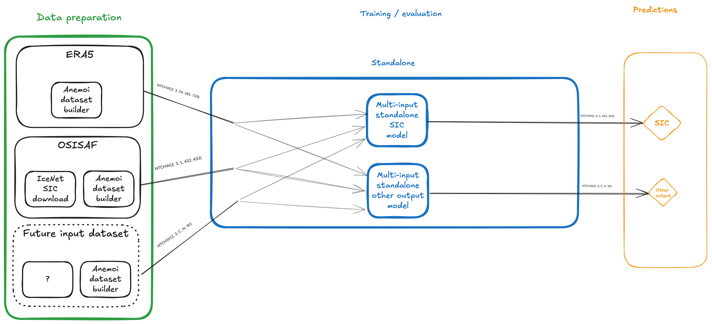
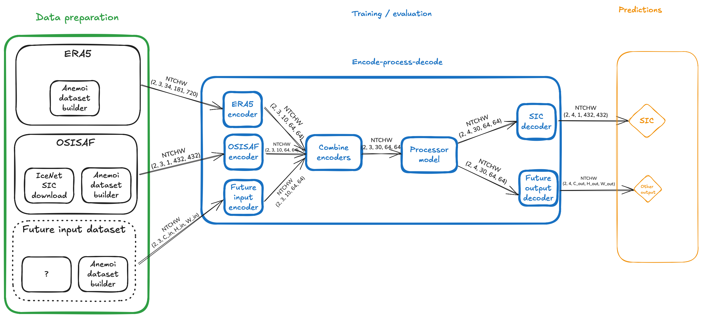

# Ice Station Zebra

A pipeline for predicting sea ice.

## Setting up your environment

### Tools

You will need to install the following tools if you want to develop this project:

- [`uv`](https://docs.astral.sh/uv/getting-started/installation/)

On an HPC system, this will install to `~/.local/bin`, so make sure that your home directory has enough free space.

### Creating your own configuration file

Create a file in the folder `ice-station-zebra/config` that is called `<your chosen name here>.local.yaml`.
You will typically want this to inherit from `base.yaml`, and then you can apply your own changes on top.
For example, the following config will override the `base_path` option in `base.yaml`:

```yaml
defaults:
  - base
  - _self_

base_path: /local/path/to/my/data
```

You can then run this with, e.g.:

```bash
uv run zebra <command> --config-name <your local config>.yaml
```
You can also use this config to override other options in the `base.yaml` file, as shown below:

```yaml
defaults:
  - base
  - override /model: cnn_unet_cnn # Use this format if you want to use a different config

# Override specific model parameters
model:
  processor:
    start_out_channels: 37 # Use this format to override specific model parameters in the named configs

base_path: /local/path/to/my/data
```

Alternatively, you can apply overrides to specific options at the command line like this:

```bash
uv run zebra <command> ++base_path=/local/path/to/my/data
```

Note that `persistence.yaml` overrides the specific options in `base.yaml` needed to run the `Persistence` model.

## Running on HPC

For running on a shared HPC systems (Baskerville, DAWN or Isambard-AI), you will want to use the pre-downloaded data and the right GPU accelerator.
This is handled for you by including the appropriate config file:

```yaml
defaults:
  - base
  - baskerville OR dawn OR isambard-ai
  - data-full OR data-sample
  - _self_
```

See `config/demo-north.yaml` for an example of this.


## Running Zebra commands

:information_source: Note that if you are running the below commands locally, specify the base path in your local config, then add the argument `--config-name <your local config>.yaml`.

### Create

You will need a [CDS account](https://cds.climate.copernicus.eu/how-to-api) to download data with `anemoi` (e.g. the ERA5 data).

Run `uv run zebra datasets create` to download datasets.

N.b. For very large datasets, use `load_in_parts` instead (see [Downloading large datasets](#downloading-large-datasets) below).

### Inspect

Run `uv run zebra datasets inspect` to inspect datasets (i.e. to get dataset properties and statistical summaries of the variables).

### Train

Run `uv run zebra train` to train using the datasets specified in the config.

:information_source: This will save checkpoints to `${BASE_DIR}/training/wandb/run-${DATE}$-${RANDOM_STRING}/checkpoints/${CHECKPOINT_NAME}$.ckpt`. Where the `BASE_DIR` is the base path to the data defined in your config file.

If you run into a `NotImplementedError` that asks you to set your environment variable `PYTORCH_ENABLE_MPS_FALLBACK=1`, adding `antialias_val: false` in your local configuration file will allow you to train to completion (see [issue 127](https://github.com/alan-turing-institute/ice-station-zebra/issues/127))


### Evaluate

Run `uv run zebra evaluate --checkpoint PATH_TO_A_CHECKPOINT` to evaluate using a checkpoint from a training run.

## Adding a new model

### Background

An `ice-station-zebra` model needs to be able to run over multiple different datasets with different dimensions.
These are structured in `NTCHW` format, where:
- `N` is the batch size,
- `T` is the number of history (forecast) steps for inputs (outputs)
- `C` is the number of channels or variables
- `H` is a height dimension
- `W` is a width dimension

`N` and `T` will be the same for all inputs, but `C`, `H` and `W` might vary.

Taking as an example, a batch size (`N=2`), 3 history steps and 4 forecast steps, we will have `k` inputs of shape `(2, 3, C_k, H_k, W_k)` and one output of shape `(2, 4, C_out, H_out, W_out)`.

### Standalone models

A standalone model will need to accept a `dict[str, TensorNTCHW]` which maps dataset names to an `NTCHW` Tensor of values.
The model might want to use one or more of these for training, and will need to produce an output with shape `N, T, C_out, H_out, W_out`.

As can be seen in the example below, a separate instance of the model is likely to be needed for each output to be predicted.



Pros:
- all input variables are available without transformation

Cons:
- hard to add new inputs
- hard to add new outputs

### Processor models

A processor model is part of a larger encode-process-decode step.
Start by defining a latent space as `(C_latent, H_latent, W_latent)` - in the example below, this has been set to `(10, 64, 64)`.
The encode-process-decode model automatically creates one encoder for each input and one decoder for each output.
The dataset-specific encoder takes the input data and converts it to shape `(N, T, C_latent, H_latent, W_latent)`.
The `k` encoded datasets can then be combined in latent space to give a single dataset of shape `(N, T, k * C_latent, H_latent, W_latent)`.

This is then passed to the processor, which must accept input of shape `(N, T, k * C_latent, H_latent, W_latent)` and produce output of the same shape.

This output is then passed to one or more output-specific decoders which take input of shape `(N, T, k * C_latent, H_latent, W_latent)` and produce output of shape `(N, T, C_out, H_out, W_out)`.



Pros:
- easy to add new inputs
- easy to add new outputs

Cons:
- input variables have been transformed into latent space

## Jupyter notebooks

There are various demonstrator Jupyter notebooks in the `notebooks` folder.
You can run these with `uv run --group notebooks jupyter notebook`.

A good one to start with is `notebooks/demo_pipeline.ipynb` which gives a more detailed overview of the pipeline.

## Downloading large datasets
For particularly large datasets, e.g. the full ERA5 dataset, it may be necessary to download the data in parts.

### Automated approach (recommended)

The `load_in_parts` command automates the process of downloading datasets in parts, tracking progress, and allowing you to resume interrupted downloads:

```bash
uv run zebra datasets load_in_parts --config-name <your config>.yaml
```

This command will:
- Automatically initialise the dataset if it doesn't exist
- Load all parts sequentially, tracking progress in a part tracker file
- Skip already completed parts if the process is interrupted and restarted
- Handle errors gracefully (by default, continues to the next part on error)

You will then need to finalise the dataset when done.

```bash
uv run zebra datasets finalise --config-name <your config>.yaml
```

#### Options

- `--continue-on-error` / `--no-continue-on-error` (default: `--continue-on-error`): Continue to next part on error
- `--force-reset`: Clear existing progress tracker and start from part 1. Anemoi will check whether you have the data already and continue.
- `--dataset <name>`: Run only a single dataset by name (useful when you have multiple datasets in your config). Make sure you use the dataset name and not the name of the config.
- `--total-parts <n>`: Override the computed total number of parts (useful if you want more / fewer parts than the default 10)
- `--overwrite`: Delete the dataset directory before loading (use with caution!)

#### Examples

Load all parts for all datasets, resuming from where you left off:
```bash
uv run zebra datasets load_in_parts --config-name <your config>.yaml
```

Load a specific dataset with a custom number of parts:
```bash
uv run zebra datasets load_in_parts --config-name <your config>.yaml --dataset my_dataset --total-parts 25
```

Start fresh, clearing any previous progress (doesn't delete any data):
```bash
uv run zebra datasets load_in_parts --config-name <your config>.yaml --force-reset
```
Start and destroy any previously saved data (careful):
```bash
uv run zebra datasets load_in_parts --config-name <your config>.yaml --overwrite
```


### Manual approach (advanced)

If you need more control, you can manually manage the download process:

1. First initialise the dataset:
```bash
uv run zebra datasets init --config-name <your config>.yaml
```

2. Then load each part `i` of the total `n` in turn:
```bash
uv run zebra datasets load --config-name <your config>.yaml --parts i/n
```

3. When all the parts are loaded, finalise the dataset:
```bash
uv run zebra datasets finalise --config-name <your config>.yaml
```
