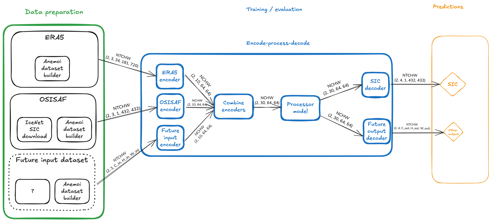

# Adding new models

## Background

An `ice-station-zebra` model needs to be able to run over multiple different datasets with different dimensions.
These are structured in `NTCHW` format, where:
- `N` is the batch size,
- `T` is the number of history (forecast) steps for inputs (outputs)
- `C` is the number of channels or variables
- `H` is a height dimension
- `W` is a width dimension

`N` and `T` will be the same for all inputs, but `C`, `H` and `W` might vary.

Taking as an example, a batch size (`N=2`), 3 history steps and 4 forecast steps, we will have `k` inputs of shape `(2, 3, C_k, H_k, W_k)` and one output of shape `(2, 4, C_out, H_out, W_out)`.

## Standalone models

A standalone model will need to accept a `dict[str, TensorNTCHW]` which maps dataset names to an `NTCHW` Tensor of values.
The model might want to use one or more of these for training, and will need to produce an output with shape `N, T, C_out, H_out, W_out`.

As can be seen in the example below, a separate instance of the model is likely to be needed for each output to be predicted.

Pros:
- all input variables are available without transformation

Cons:
- hard to add new inputs
- hard to add new outputs

## Processor models

A processor model is part of a larger encode-process-decode step.
Start by defining a latent space as `(C_latent, H_latent, W_latent)` - in the example below, this has been set to `(10, 64, 64)`.
The encode-process-decode model automatically creates one encoder for each input and one decoder for each output.
The dataset-specific encoder takes the input data and converts it to shape `(N, C_latent, H_latent, W_latent)`, compressing the time and channels dimensions.
The `k` encoded datasets can then be combined in latent space to give a single dataset of shape `(N, k * C_latent, H_latent, W_latent)`.

This is then passed to the processor, which must accept input of shape `(N, k * C_latent, H_latent, W_latent)` and produce output of the same shape.

This output is then passed to one or more output-specific decoders which take input of shape `(N, k * C_latent, H_latent, W_latent)` and produce output of shape `(N, T, C_out, H_out, W_out)`, regenerating the time dimension.

Pros:
- easy to add new inputs
- easy to add new outputs

Cons:
- input variables have been transformed into latent space
- time-step information has been compressed into the latent space
